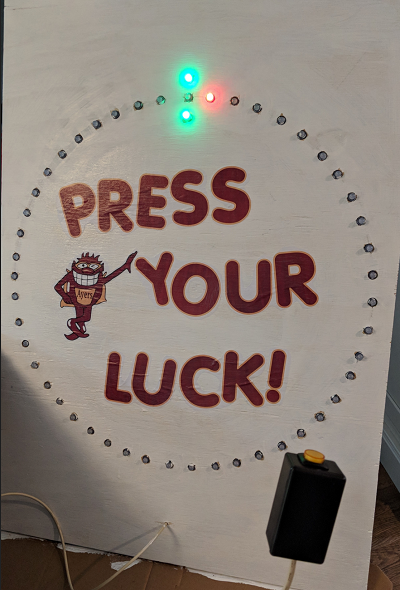

# Press Your Luck

This is a very simple game which I made for a event at my kids school. 

# Parts List

 * An Arduino
 * Some kind of button
 * 50 Neopixel / WS2811 LED Strip (I used: [These](https://www.amazon.com/gp/product/B01AG923GI/ref=oh_aui_search_detailpage?ie=UTF8&psc=1))
 * A Board

# What it Looks Like

# Setup

 * The LEDS are mounted to the board with the first three LEDs at the top to indicate the target (LED 1 is the bottom, LED 2 is the middle and LED 3 is the top)
 * The button is wired to ground and *pin 2* on the arduino (A pin supporting interrupts is required)
 * The neopixel strip is connected to *GND*, *5V*, and digital *pin 6*

# Modes
 * If you hold the button for 3 seconds, it will toggle between a 'fast' mode and a 'slower' mode (good for little kids).

# Life Lessons
 * My original plan was to have all the LEDs lit up, but this draws too much power, and the colors start to fade out (rather than white, LEDs look pink, then red). So, I simplified things and only have 3 LEDs lit at any one time. Adding a 5V power supply should be pretty straight forward (Follow [Adafruits Advice](https://learn.adafruit.com/adafruit-neopixel-uberguide/powering-neopixels)).

# CMake?
 * In this project you'll also find a CMake project -- I used this to test out the 'wheel' class, and you could just ignore this.

# Loading
 * I loaded this using  Arduino for Visual Studio Code, and I did not try it using the Arduino IDE. It probably should just work... but I didn't test it. 
 